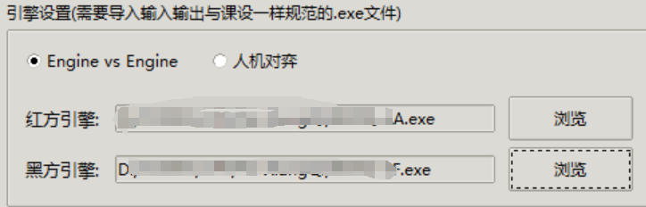
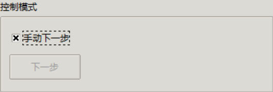
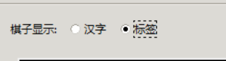
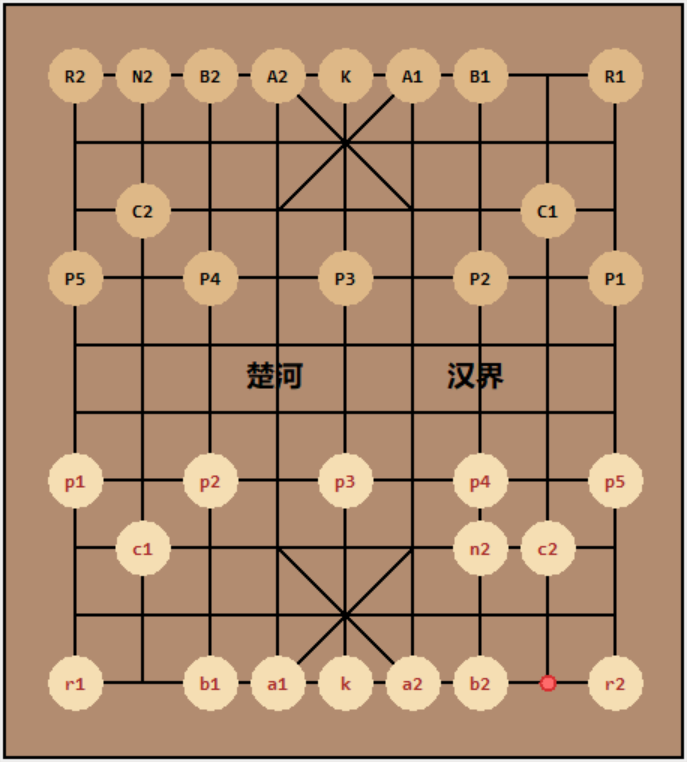

# A-XiangQiGUI 算法课设象棋引擎测试工具

集成了**引擎对弈/自博**与**基础人机对弈**功能(其实就是再开一个线程)，配合简易可视化界面，方便在 Windows 平台上快速测试课设程序（即你所开发的象棋引擎）


---

##  程序说明

* 使用python原生库，开发版本python 3.12.4
* version 1.0.0

>  ⚠️ 由于当前仅支持 `.exe` 格式的引擎文件，暂不适用于 Linux 环境。后续随缘更新。

---

##  功能说明

### 引擎对弈

程序内部引擎仅负责：

* 维护并实时显示当前棋盘状态
* 实现不同引擎之间的输入/输出格式镜像转换
* 维护下棋过程的日志

**⚠️注意：**
程序本体**不负责校验走法是否合法**，所有规则判断、每一步的合法性验证需由引擎自身实现。
若某一方引擎输出错误或格式不符，可能导致棋盘上的棋子异常消失/瞎走，需要自行解决；

### 人机对弈

玩家可以通过拖动棋子与引擎对弈。

**⚠️注意：**
* 大活人玩家同样可进行**任意走法**，程序**不验证其合法性**
* 错误走法可能导致引擎接收无效输入，触发报错，此时只能重新开始对局，无法撤销/回溯
* 好像有Bug，轮到你拖动的时候，走太快可能会没法把操作传递给对面，慢一点别太急

---

##  使用方法

1. **将自己的引擎打包为 `.exe` 文件**

   * C/C++ 实现的引擎可直接编译生成 `.exe`
   * 其他语言（如 Python、Java）请使用相应工具（如 `pyinstaller`）将程序打包成 `.exe`
   * 使用这个格式是为了我自己方便
  


2. **确保输入输出格式严格符合课设要求**

   * 即每一步的输出需为，绝不多余：
     ```
     （棋子代号） （x坐标） （y坐标）
     ```

     示例：`p1 4 5`
    * 先接受大写英文 START 的为红方
    * 你可以为了方便在将军/胜利的时候输出不一样的内容，程序接收到这个内容会自行因异常终止棋局
    * 理论上收发的都是UTF-8，但应该不影响


3. **运行并使用**

   * 运行 `self_fight.py`
   * 在面板上分别导入红方与黑方引擎，如下
   * 
      
   * 点击 开始对居 后，程序将自动循环执行，直到某方输出非法或引擎报错
   * 对局的结果和过程需要自行观察
   * 以防下的太快看不清，提供了一个 手动触发引擎下一步 的功能（如下），但逻辑顺序上可能有点问题，用的话要习惯一下；（另外这个前面是 x 的时候才是选中，懒得改了）
   * 
      
   * 可以自己设置全局变量决定步数上限，当前为300步
   * 可以自行切换棋子的显示方式为汉字/课设定义的标签，但切换的时候会刷新一下，某些情况下可能改变棋盘的状态
   * 
      
   * 机器对弈的时候我用了一个红点表示上一步移动的起点，但没有标注移动的终点，需要自己观察一下，如下图，表示 n2 移动的起点：
   * 
      
   * 人机对弈的时候，你需要长按棋子，拖动，红圈标记了起点（可以放回去，不算走了这一步），松手之后会放到离得最近的位置上（不可撤销，会直接把这一步发给对面，尽量摆正，且确定自己的下法合法）；
   * 某些情况下，开始对局的时候可能会打开两个控制台，是你的程序在跑，别关；
  

---

##  目的

* 清晰、快速的进行程序效果验证
* 避免因为人机对弈、机器对弈、黑红转换等情况下，输入输出格式要频繁调整，麻烦烧脑且浪费时间

---

自测正常，但不排除有极大的bug，如果出现了非常奇怪的情况，且确定不是由于自己的程序导致的，欢迎反馈，随缘更新

理论上自己运行不会让Windows的防火墙拦截，但如果发生了这个情况需自行解决，源码都在，安全性高高的

---
